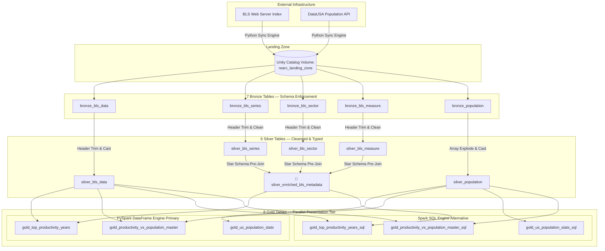

# Rearc Data Quest — Architectural Design & Process Log

**Candidate:** Hariharasudhan  
**Track:** Data Engineering Quest (Databricks / Lakeflow Edition)  
**Submission Timeline:** Sunday, 13th September 2026  

---

## 🏛️ 1. Architecture & Design Rationale

This pipeline implements a production-grade **Medallion Architecture** managed via **Spark Declarative Pipelines (Delta Live Tables / Lakeflow)** within the Databricks Unity Catalog environment. The primary design goal is the **Separation of Concerns**: isolating untrusted network ingestion from parallelised transformations, thereby protecting the integrity of downstream data assets.

### Layer Strategy & Modeling Choices
*   **The Landing Zone (Volume):** Raw text and JSON files are dropped unmodified directly into a Unity Catalog Volume. This acts as our landing storage layer. It guarantees a historical audit trail: if downstream Spark clusters or business logic break, we can re-verify the raw inputs without hitting the remote external HTTP servers again.
*   **Bronze Layer:** Standardizes the raw directory files into tables using light structural schemas. To handle inconsistent column padding standard inside raw government metadata fields (e.g., `'series_id        '`), the Bronze layer executes a programmatic string-cleaning loop that runs `.strip()` across all headers dynamically during ingestion.
*   **Silver Layer:** Cleans, formats, and casts data cells to double-precision `Double`, `Int`, and `Long` formats. Most importantly, it isolates the core fact dataset (`silver_bls_data`) from supporting lookup dimensions, while pre-materializing a consolidated **Wide Star Schema Lookup** (`silver_enriched_bls_metadata`). Pre-joining low-cardinality metadata datasets at this tier eliminates the need for expensive multi-stage distributed shuffles later.
*   **Gold Layer:** Curates data products tailored directly to business metrics. Instead of hardcoding business logic (`WHERE series_id = 'PRS30006032'`), it materializes a generic, scalable left-joined master database layout. This satisfies the challenge conditions while allowing downstream users to slice any industry slice interactively without code changes.

### Core Dual Fluency: PySpark vs. Spark SQL
To establish complete technical fluency, the solution materializes the analytical assets side-by-side inside the declarative framework using both engines:
*   **Why PySpark was Chosen as Primary:** For the core production tables (`gold_us_population_stats`, etc.), the **PySpark DataFrame API** was deployed. In an enterprise environment, PySpark is preferred for orchestration because it provides clean object-oriented unit testing, parameterization, and programmatic loops.
*   **Why Spark SQL was Deployed as the Alternative:** The matching `*_sql` endpoints run native ANSI SQL structures (utilizing Common Table Expressions and distributed Window queries). This shows equal proficiency in writing performant declarative SQL queries directly against big data clusters.

### Safe Ingestion Re-Runs (Incremental Syncing)
The `src/step1_ingestion.py` engine guarantees strict idempotency at the network boundary. Before downloading any payload body, the crawler sends a lightweight HTTP `HEAD` request to query the server's `Content-Length` metadata. If a local file already exists in the Volume and its byte size matches perfectly, the network transfer is skipped entirely. If a file is updated on the remote server, the size mismatch triggers a safe atomic overwrite, making the ingestion fully resilient across repeated runs.

---

## ⚖️ 2. Production Trade-offs (Real-World Client Architecture)

If executing this project for a live enterprise client with massive scaling metrics, I would modify the architecture to address the following production constraints:

### A. Schema Drift Management
*   *Current Quest Approach:* Programmatically loops and strips whitespace from hardcoded source targets.
*   *Enterprise Approach:* Public open APIs frequently change key names or add elements without warning. I would configure **Delta Schema Evolution** and deploy a strict schema validation gate using **DLT Schema Enforcement**. Any unrecognized structural drift parameters would automatically route raw anomalies into a quarantined "Dead Letter Queue" (DLQ) table for developer review without stopping the active streaming cluster job.

### B. High Data Volume Processing
*   *Current Quest Approach:* Streams the entire `pr.data.0.Current` file via single-node compute.
*   *Enterprise Approach:* As data volumes scale into billions of entries, processing the complete historical ledger every run becomes bottlenecked. I would pivot the Bronze-to-Silver framework into a true **Streaming Live Table Engine** using Databricks **Auto Loader (`cloudFiles`)**. It tracks file system state updates natively, performing incremental delta appends rather than expensive table overwrites.

### C. Cost Optimization
*   *Current Quest Approach:* Executes standard DLT tasks on a triggered single-node architecture.
*   *Enterprise Approach:* For a real client, running dedicated cluster allocations continuously spikes operational costs. I would configure the jobs to leverage **Serverless DLT / Lakeflow Compute** with automated vertical **Auto-Scaling (Enhanced Autoscaling)**. This dynamically adds workers during heavy morning ETL runs and scales down to zero when idle, lowering cloud overheads.

### D. Governance & Enterprise Access Control
*   *Current Quest Approach:* Configured a standard manual SQL user group assignment block inside the workspace console namespace.
*   *Enterprise Approach:* To manage security at scale, I would automate the infrastructure using **Terraform** connected to an enterprise Identity Provider via SCIM (e.g., Okta or Entra ID). I would also implement **Row-Level Security (RLS)** filters and **Column-Level Data Masking** tags inside the Unity Catalog layer, ensuring internal analytics users only see data rows relevant to their assigned regions or compliance clearings.

### E. Monitoring & Production Alerting
*   *Current Quest Approach:* Logs output notifications directly onto the execution screen panel.
*   *Enterprise Approach:* Production environments require instant notification metrics. I would wire the DLT event log outputs directly into enterprise telemetry platforms (such as Prometheus, Grafana, or Databricks SQL Alerts). If data quality expectations drop beneath a set threshold (e.g., if more than 2% of rows fail validation keys), the system would immediately trigger automated pages to the on-call engineering team via PagerDuty or Slack webhooks.

---

## 🧠 3. Engineering Retrospective (Hardest Challenges Overcome)

1.  **The Hidden Whitespace Header Trap:** The most time-consuming challenge was debugging the invisible whitespace padding characters embedded inside the raw BLS column headers (e.g., `'series_id        '`). Because the file format uses variable tab spacing, Spark's standard CSV parser read the column names literally. Standard downstream filter evaluations failed silently with `Column not found` exceptions. This was resolved by designing an automated header-cleaning loop at the Bronze boundary that dynamically runs `.strip()` across all columns, making the pipeline completely resilient.
2.  **Special Characters in JSON Keys:** The nested DataUSA population JSON response returned structural property strings containing invalid space characters (such as `Nation ID` and `ID Year`). Delta Tables natively block these characters, which crashed the initial database registration step. To fix this without writing rigid, hardcoded schema parsing logic, I enabled native **Delta Column Mapping** (`delta.columnMapping.mode = name`) directly inside the DLT configurations. This cleanly uncouples the logical query language names from the underlying storage layer, allowing the pipeline to safely handle arbitrary schemas without errors.

### Data Governance (Unity Catalog ACLs)
Enforced strict access rules by provisioning a custom user group (`read_only_analysts`). Using standard ANSI SQL statements, this group was granted `SELECT` privileges exclusively on the Gold reporting layers. Because no privileges are issued for the Bronze tables, Silver tables, or landing Volumes, analysts are implicitly blocked from accessing raw files, preventing unauthorized data discovery.

### Self-Service BI (Genie Spaces & Dashboards)
Layered an interactive **Databricks Genie Space** and a **Lakeview Dashboard** on top of the Gold master tables. By providing parameter dropdown filters and feeding the conversational agent plain-text context instructions (mapping terms like *"First Quarter"* to `'Q01'`), non-technical business leaders can safely analyze macroeconomic trends on demand without writing a single line of database code.
