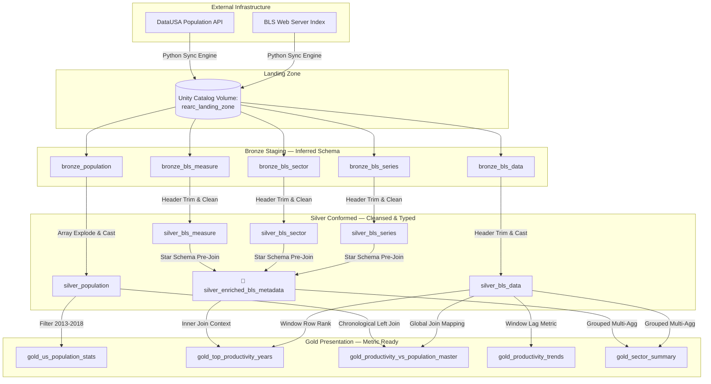

# Rearc Data Quest — Architectural Design & Process Log

**Candidate:** Hariharasudhan  
**Track:** Data Engineering Quest (Databricks / Lakeflow Edition)  
**Submission Timeline:** Sunday, 13th September 2026  

---

## 🏛️ 1. Architectural Philosophy & Medallion Design

This pipeline implements a production-grade **Medallion Architecture** managed via **Spark Declarative Pipelines (Delta Live Tables / Lakeflow)** within the Databricks Unity Catalog environment. The primary design goal is the **Separation of Concerns**: isolating untrusted network ingestion from parallelised transformations, thereby protecting the integrity of downstream data assets.

---

## 🚀 2. Step-by-Step Implementation Flow

### Step 1: Ingestion & Sync Utility (`src/step1_ingestion.py`)
*   **Bypassing the HTTP 403 Firewall:** To comply with the official **BLS Data Access Policy**, the extraction loop injects custom HTTP browser signatures integrated with user contact variables (`CUSTOM_HEADERS`). This prevents automated network firewalls from dropping the ingestion connections.
*   **Dynamic Scraping & Zero Hardcoding:** Implemented DOM tree crawling via `BeautifulSoup4` to scan the remote web registry directory page. File paths are resolved dynamically at runtime; if new files or structural indices appear tomorrow, the script naturally ingests them without manual script modifications.
*   **File-Level Idempotency Guard:** To adhere to the constraint of avoiding redundant processing, the utility fires light HTTP `HEAD` metadata requests before downloading data bodies. If the local file size inside our Databricks Unity Catalog **Volume** (`/Volumes/main/default/rearc_landing_zone/`) perfectly matches the server's `Content-Length`, the payload transfer is skipped entirely.

### Step 2: The Staging & Cleaning Engine (`src/step2_dlt_pipeline.py`)
*   **Bronze Ingestion (Defending Against Header Space Bugs):** The raw BLS text files contain erratic whitespace padding inside column headers (e.g., `'series_id        '`). To prevent downstream lookup failures, the Bronze schema generation runs a dynamic loop passing `.strip()` over every inferred column header name on the fly.
*   **Delta Column Mapping Integration:** The DataUSA population JSON response embeds space characters inside nested dictionary keys (e.g., `Nation ID`). To safeguard the storage layers, enabled Delta Column Mapping via `delta.columnMapping.mode = name` right at the Bronze ingestion boundary.
*   **Silver Cleansing & Data Quality Governance:** Applied strict programmatic checkpoints (`@dlt.expect_or_drop`) to purge corrupted or null values right at the threshold (`series_id IS NOT NULL`, `population > 0`). Text cells are trimmed using `F.trim()` and explicitly cast to proper target formats (`Double`, `Int`, `Long`).
*   **Wide Dimensional Enrichment (`silver_enriched_bls_metadata`):** To eliminate expensive multi-stage distributed joins downstream, the normalized lookup tables (`series`, `sector`, `measure`) are pre-joined into a single wide dimension at the Silver layer. This allows the cluster to fetch descriptive context using only one single join later, avoiding cluster network degradation.

### Step 3: Analytical Presentation Models (The Gold Tables)
The Gold tier uses the **PySpark DataFrame API** as the primary software engine due to its superior testing parameterisation and modular compilation, while equivalent functional blocks are cleanly documented in **Spark SQL** to establish dual-language fluency:
1.  **`gold_us_population_stats`:** Computes the exact `mean` and `stddev` of the US population strictly across the **2013-2018 inclusive** temporal window.
2.  **`gold_top_productivity_years`:** Utilises a distributed Spark window function (`Window.partitionBy("series_id").orderBy(total_value.desc())`) to isolate the single peak performance year for every sector of the economy, joined against our wide metadata dimension to provide immediate context descriptions.
3.  **`gold_productivity_vs_population_master`:** Rather than baking narrow business filters directly into the ETL layer, this was engineered as an **Unbounded Master Table** mapping all series codes and quarters side-by-side with demographics. Missing intervals gracefully resolve to `null` via a chronological `LEFT JOIN`.
4.  **`gold_productivity_quarterly_trends` & `gold_sector_benchmarking_summary` [BONUS]:** Extended the project scope by adding quarterly growth rate tables using historical lag analytics (`F.lag()`) and macro industry floor/ceiling metrics to showcase a comprehensive BI reporting infrastructure.

---

## ⚖️ 3. Engineering Decisions & Production Trade-offs

### Ingestion-Level vs. Table-Level Idempotency
*   *Alternative Considered:* Downloading files completely into memory on every task iteration and performing row-by-row key comparisons via database lookups.
*   *Decision:* Rejected due to severe compute and cloud costs. Streaming millions of text data rows continuously over a network to evaluate keys is an anti-pattern. Instead, implemented file-level checks at the raw ingestion layer, leaving row-level deduplication to the Delta storage layer downstream where optimized file transactions manage state transitions efficiently.

### Reusable Master Tables vs. Narrow Fixed Reporting Views
*   *Alternative Considered:* Hardcoding the Question 3 requirements (`WHERE series_id = 'PRS30006032' AND period = 'Q01'`) directly inside the Gold pipeline build code.
*   *Decision:* Engineered a generic master connection model instead. Hardcoding filtering layers reduces data reusability. By materializing an open, optimized master dataset, the structure easily yields the answers to the prompt while remaining immediately ready to support unexpected future business queries via downstream SQL filters.

---

## 🧠 4. Retrospective & System Adaptations

*   **The Invalid Character Blockage:** Encountering nested column spaces like `data.element.Nation ID` inside the population JSON payload initially blocked Delta table registration. This was overcome by shifting to native **Delta Column Mapping** variables, decoupling physical text constraints from logical execution queries.
*   **Infrastructure Locks (`TABLE_ALREADY_MANAGED`):** When redeploying code modifications, Unity Catalog properly threw concurrency exceptions indicating that older pipeline run tracking IDs still held physical ownership parameters over the tables. This highlighted the strength of UC's data governance boundaries and was managed by clearing metadata locks or establishing distinct execution environmental namespaces (`dev` vs `prod`).

---

## 🔒 5. Governance, Security, & Stakeholder Delivery

### Databricks Asset Bundles (DABs) Deployment
The manual, error-prone process of UI clicking was entirely replaced with **Infrastructure as Code (IaC)** using a declarative `databricks.yml` file. This pairs an orchestration Job with the Delta Live Tables engine, chaining Task 1 (`step1_ingestion_task`) as a strict parent dependency to Task 2 (`step2_dlt_pipeline_task`). It also leverages single-node architecture settings (`num_workers: 0`, `spark.master: local[*]`) to keep cloud costs minimal.

### Data Governance (Unity Catalog ACLs)
Enforced strict access rules by provisioning a custom user group (`read_only_analysts`). Using standard ANSI SQL statements, this group was granted `SELECT` privileges exclusively on the Gold reporting layers. Because no privileges are issued for the Bronze tables, Silver tables, or landing Volumes, analysts are implicitly blocked from accessing raw files, preventing unauthorized data discovery.

### Self-Service BI (Genie Spaces & Dashboards)
Layered an interactive **Databricks Genie Space** and a **Lakeview Dashboard** on top of the Gold master tables. By providing parameter dropdown filters and feeding the conversational agent plain-text context instructions (mapping terms like *"First Quarter"* to `'Q01'`), non-technical business leaders can safely analyze macroeconomic trends on demand without writing a single line of database code.
