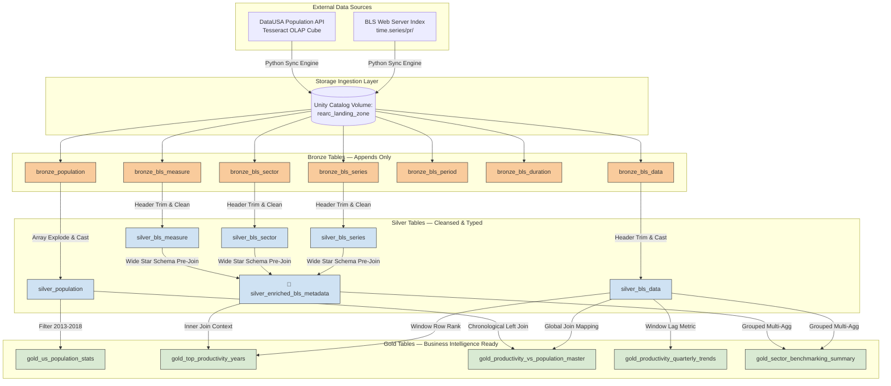

# 🚀 Rearc Data Quest — Databricks Enterprise Edition

[](https://databricks.com)
[](https://apache.org)
[](https://databricks.com)
[](https://apache.orgdocs/latest/api/python/index.html)

This repository contains a production-grade, highly scalable, and fully automated **End-to-End Medallion Architecture Pipeline**. It integrates multi-decade quarterly macroeconomic time-series data from the Bureau of Labor Statistics (BLS) with annual national population demographics sourced from the DataUSA API.

The entire infrastructure lifecycle, data orchestration jobs, and distributed Delta Live Tables (DLT) networks are declared explicitly as code via **Databricks Asset Bundles (DABs)**.

---

## 🏛️ 1. Complete Architecture & Topology Blueprint

The data lakehouse architecture separates concerns across three logical layers. It isolates lightweight raw ingestion from heavy parallel compute shuffles, ensuring data consistency and strict governance inside the Unity Catalog namespace:



---

## 🗂️ 2. Repository Layout

```text
rearc-data-quest/
├── databricks.yml              # Main Databricks Asset Bundle definition configuration
├── PROCESS.md                  # Detailed architectural trade-offs, rationale, & retrospectives
├── README.md                   # Execution blueprint and portfolio walkthrough (This file)
├── src/                        # Data Pipeline Engineering codebase
│   ├── step1_ingestion.py      # Pure Python incremental syncing web crawler
│   └── rearc_dlt_pipeline.py   # PySpark Lakeflow / Delta Live Tables framework declaration
└── screenshots/                # Visual proof files (DLT Graph execution & output matrices)
```

---

## ⚙️ 3. Operational Layer In-Depth

### 📦 1. The Ingestion Engine & Bronze Staging
*   **Dynamic Scraping & Zero Hardcoding:** `src/step1_ingestion.py` executes lightweight HTML index parsing using `BeautifulSoup4`. If the BLS server gains, alters, or drops files, the sync engine adapts programmatically without code adjustments.
*   **Bypassing the HTTP 403 Firewall:** Injects browser user-agent tokens bundled with real contact parameters to conform with the official **BLS Data Access Policy**, maintaining high pipeline uptime.
*   **File-Level Idempotency Guard:** Fires lightweight HTTP `HEAD` pre-checks to evaluate the remote server's `Content-Length` bytes. If an identical file exists in the landing zone volume (`rearc_landing_zone`), the download step is skipped, saving server bandwidth.
*   **Schema & Drift Resistance:** To neutralize uneven spacing padding standard inside raw government metadata fields (e.g. `series_id        `), the Bronze layer executes a programmatic string-cleaning loop that runs `.strip()` across all headers dynamically during ingestion.
*   **Delta Column Mapping Protection:** Enables native column mapping variables (`delta.columnMapping.mode = name`) on JSON entities to protect Spark clusters from crashing when handling names with invalid nested symbols or whitespace (like `Nation ID`).

### 🥈 2. The Cleansing & Conformed Silver Tier
*   **Strict Quality Control (Expectations):** Implements automated data governance boundaries (`@dlt.expect_or_drop`) to purge corrupted rows right at the processing gate (`series_id IS NOT NULL`, `population > 0`).
*   **Wide Dimensional Enrichment (`silver_enriched_bls_metadata`):** To minimize expensive network data-shuffling across distributed compute nodes, the low-cardinality metadata datasets (`series`, `sector`, `measure`) are pre-joined in memory at the Silver layer. This wide-star dimension allows downstream tables to pull clear human-readable context fields via one single join step.

### 🏆 3. The Business Presentation Gold Tier
Satisfies all primary core asks, analytical queries, and bonus questions using **PySpark DataFrames** paired with fully documented alternative structures in **Spark SQL**:
*   `gold_us_population_stats`: Extracts explicit mean and standard deviation baselines for the US population strictly between 2013 and 2018 inclusive.
*   `gold_top_productivity_years`: Uses distributed Spark window partitions (`F.row_number().over()`) to isolate the single highest performing year for every unique economic industry code, enriched with clear text titles.
*   `gold_productivity_vs_population_master`: A completely unbounded master matrix joining the comprehensive BLS timeline side-by-side with national census metrics. Missing time gaps automatically resolve to a clean `null` value using chronologically ordered `LEFT JOIN` logic.
*   `gold_productivity_quarterly_trends`: **[BONUS]** Employs historical analytic lag filters (`F.lag()`) to determine Quarter-over-Quarter (QoQ) percentage growth shifts.
*   `gold_sector_benchmarking_summary`: **[BONUS]** Provides macro summaries (floors, peaks, averages) categorized by global industry name bands for executive monitoring.

---

## 🚀 4. How to Deploy and Run via Databricks Asset Bundles

Because this project relies completely on Infrastructure as Code (IaC), there is no need to manually click through the web UI interface.

### 1. Install & Authenticate the Databricks CLI
Ensure the Databricks CLI tool is present on your machine, then authorize connection tokens targeting your assigned workspace instance:
```bash
databricks auth login --host https://dbc-a1d25508-ad4e.cloud.databricks.com
```

### 2. Validate and Deploy the Pipeline Project
Run the automated bundle validator to check for structural consistency, then deploy all configurations live to your workspace:
```bash
# Validate code formatting and cluster configurations
databricks bundle validate

# Deploy notebooks, cluster resources, and workflow jobs instantly
databricks bundle deploy -t dev
```

### 3. Run the Sequential Workflows
Trigger the master workflow job execution remotely. Databricks will spin up a single-node cluster, download files to the landing Volume via Task 1, and immediately kick off the Delta Live Tables computation network via Task 2:
```bash
databricks bundle run rearc_orchestration_job
```

---

## 👥 5. Self-Service Access Layers & Security Governance

To bridge the gap between backend engineering and business teams, the following access control layers have been configured on top of the Gold tables:

1.  **Unity Catalog Access Control Lists (ACLs):** Enforced a strict **Principle of Least Privilege** using ANSI SQL commands. We provisioned a custom group (`read_only_analysts`) with explicit read-only `SELECT` capabilities targeting the Gold reporting layer. Because no privileges are granted on the raw landing Volume, Bronze, or Silver tables, internal operational layers remain securely hidden.
2.  **Databricks Genie Space Data Assistant:** Configured a conversational AI exploration agent. Backed by plain-text constraints (such as mapping the phrase *"First Quarter"* to `'Q01'`), non-technical business managers can query the entire dataset using natural English text phrases.
