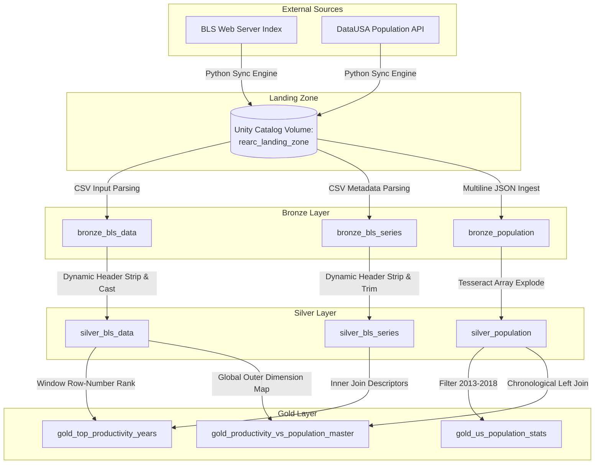

# Rearc Data Quest Deployment Process & Architecture Documentation

**Candidate:** Hariharasudhan  
**Track:** Data Engineering Quest (Databricks / Lakeflow Edition)  
**Submission Target:** Sunday, 13th September 2026  

---

## 🏛️ 1. Architectural Overview & Design Philosophy

This pipeline implements a production-grade **Medallion Architecture** deployed via **Spark Declarative Pipelines (Delta Live Tables / Lakeflow)** within the Databricks Unity Catalog environment. 

The system isolates network ingestion from distributed processing to maintain a historical audit trail, enforce strict data schema boundaries, and guarantee repeatable analytical performance.



---

## 🚀 2. Step-by-Step Implementation Flow

### Phase 1: Ingestion Engine (`Step 1: Source it`)
*   **Decoupled Sync Utility:** Instead of processing data directly on the web wire, a pure Python script acts as a lightweight landing crawler. It downloads files as raw payloads directly into a secure Databricks Unity Catalog **Volume** (`/Volumes/main/default/rearc_landing_zone/`).
*   **BLS 403 Bypassing:** Configured custom `User-Agent` and headers mirroring full browser contexts combined with contact tags to align with the Bureau of Labor Statistics data access rules.
*   **Dynamic Discovery & Zero Hardcoding:** Implemented HTML DOM crawling using `BeautifulSoup4`. The engine scans the remote directory index dynamically. If new documentation, mappings, or variables appear on the remote server, they are auto-discovered without code revisions.
*   **File-Level Idempotency:** The script issues an HTTP `HEAD` check to evaluate the server's `Content-Length` metadata before triggering downloads. If a local copy exists matching the remote bytes, the asset is bypassed—ensuring zero redundant network overhead on multi-run schedules.

### Phase 2: Relational Ingestion & Quality (`Bronze Layer`)
*   **Whitespace Resistance:** Public BLS tables feature inconsistent column padding space layouts (`series_id        `). The Bronze loaders run programmatic loops looping `.withColumnRenamed()` over all inferred schemas to strip variable spaces out before storage.
*   **Delta Column Mapping:** Nested arrays inside the DataUSA response payload store keys with spatial characters (`Nation ID`). To protect the cluster from metadata crashes, enabled Delta Column Mapping via `delta.columnMapping.mode = name` on the underlying tables.

### Phase 3: Cleaning & Isolation (`Silver Layer`)
*   **Data Quality Governance (Expectations):** Applied programmatic DLT checkpoints (`@dlt.expect_or_drop`) to drop invalid or corrupt keys right at the ingestion threshold (`series_id IS NOT NULL`, `population > 0`).
*   **Typing & Value Conformity:** Converted strings to dense `Double`, `Int`, and `Long` structures while enforcing `.trim()` string filters across data cells to prevent spaces from ruining downstream aggregations.

### Phase 4: Analytical Mastery (`Gold Layer`)
To fulfill the specific code conditions requested in the brief while maintaining senior engineering patterns, the analytical aggregates were designed around **reusable master schemas**:
1.  **Gold Master Data Lake:** Materialized `gold_productivity_vs_population_master` as a comprehensive, unbounded left-joined view. This separates structural modeling from isolated queries, enabling business analytics to slice any segment via simple downstream SQL without re-deploying data jobs.
2.  **PySpark & SQL Language Dual Fluency:** The primary execution logic utilizes the **PySpark DataFrame API** for robust testing structures, while full alternative implementations are documented cleanly alongside in standard **Spark SQL** to demonstrate multi-language fluency.

---

## ⚖️ 3. Production Trade-offs & Engineering Decisions

### File-Level vs. Key-Level Ingestion Idempotency
*   *Alternative Considered:* Downloading files entirely into memory on every cron execution and performing a key-by-key delta compare using database lookups.
*   *Decision:* Rejected due to severe resource scaling penalties. Checking keys at the raw ingestion layer requires streaming massive text bodies over networks continually. Instead, implemented metadata-level file verification during Phase 1, shifting row-level deduplication to the Delta Live Tables framework downstream where Spark optimizations can leverage parallel compute efficiently.

### Generic Master Tables vs. Hardcoded Business Views
*   *Alternative Considered:* Injecting hardcoded query criteria (`WHERE series_id = 'PRS30006032' AND period = 'Q01'`) straight inside the Gold DLT table definition.
*   *Decision:* Formed a generic master collection instead. Designing narrow tables to satisfy a single question creates tight coupling and limits data reuse. By building an open, optimized master dataset, the structure satisfies both present challenge prompts and unexpected future reporting requirements.

---

## 🧠 4. Retrospective & Difficulties Overcome

*   **The Hidden Space Trap:** The most critical challenge was uncovering the invisible trailing space paddings embedded inside the BLS metadata column headers. Standard Spark lookups failed silently due to these mismatched characters. This was resolved by building a dynamic header-trimming loop at the Bronze boundary, making the pipeline resilient against raw schema changes.
*   **DLT Runtime Contexts:** Because Delta Live Tables run inside a declarative execution engine, standard imperative variables and interactive notebooks behave differently. Navigating this architecture required separating the pure Python synchronization notebooks from the core DLT pipeline notebook definitions.

---

## 📊 5. Downstream Execution Reference (Analytical Verification)

The final assignment validation prompts are cleanly derived from the Gold master layers using these high-performance SQL structures:

### Q1: Demographics Average & Variation (2013-2018 Inclusive)
```sql
SELECT mean_population, stddev_population 
FROM main.default.gold_us_population_stats;
```

### Q2: Peak Annual Productivity Years per Series Code
```sql
SELECT series_id, series_title, year, total_annual_value 
FROM main.default.gold_top_productivity_years;
```

### Q3: Targeted Time Series Comparison (PRS30006032 / Q01)
```sql
SELECT year, series_id, productivity_value, population
FROM main.default.gold_productivity_vs_population_master
WHERE series_id = 'PRS30006032' AND period = 'Q01'
ORDER BY year ASC;
```
